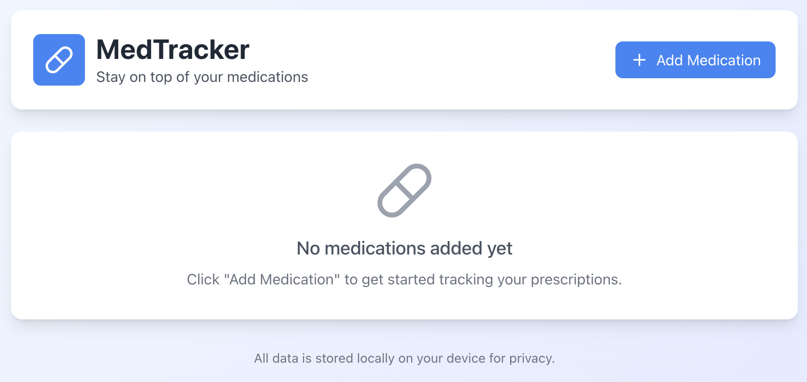
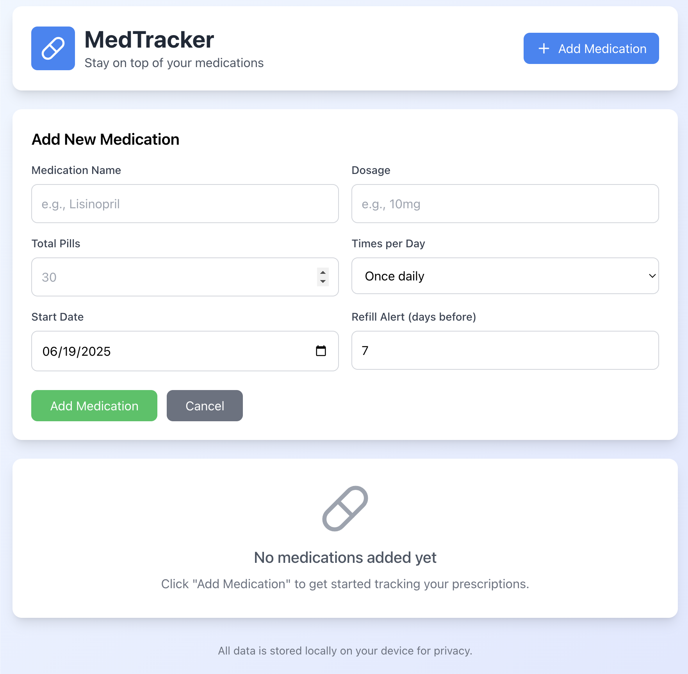
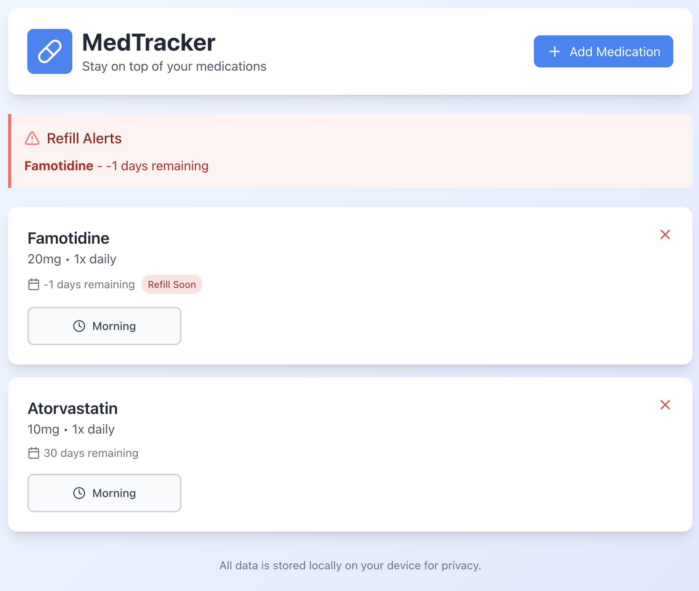

# 💊 MedTracker - Prescription Medication Tracker

A modern, user-friendly React application designed to help users manage their prescription medications, track daily doses, and receive timely refill alerts.


## 🌟 Features

### Core Functionality
- **Add Medications**: Easy-to-use form for inputting medication details
- **Flexible Scheduling**: Support for 1-4 daily doses with automatic time slot assignment
- **Daily Dose Tracking**: Simple click-to-mark interface for tracking taken doses
- **Smart Refill Alerts**: Automatic notifications when prescriptions are running low
- **Days Remaining Calculator**: Real-time calculation of remaining medication supply

### User Experience
- **Privacy-First**: All data stored locally on user's device
- **Responsive Design**: Works seamlessly on desktop and mobile devices
- **Intuitive Interface**: Clean, medical-app inspired design
- **Visual Feedback**: Color-coded dose tracking and refill alerts

## 🚀 Live Demo

[View Live Demo](https://medication-tracker-seven.vercel.app/) 

## 🛠️ Technologies Used

- **Frontend**: React 18 with Hooks (useState, useEffect)
- **Styling**: Tailwind CSS via CDN
- **Icons**: Lucide React
- **Storage**: Browser localStorage
- **Build Tool**: Create React App

## 📱 Screenshots

### Main Dashboard



### Add Medication Form



### Refill Alerts



## 🏁 Getting Started

### Prerequisites
- Node.js (v14 or higher)
- npm or yarn

### Installation

1. **Clone the repository**
   ```bash
   git clone https://github.com/TylerLeachGIT/medication-tracker.git
   cd medication-tracker
   ```

2. **Install dependencies**
   ```bash
   npm install
   ```

3. **Install Lucide React icons**
   ```bash
   npm install lucide-react
   ```

4. **Start the development server**
   ```bash
   npm start
   ```

5. **Open your browser**
   Navigate to `http://localhost:3000`

### Styling Setup
This project uses Tailwind CSS via CDN for simplicity. The CDN is already configured in `public/index.html`.

## 💡 Usage

### Adding a Medication
1. Click the "Add Medication" button
2. Fill in the medication details:
   - Name (e.g., "Lisinopril")
   - Dosage (e.g., "10mg")
   - Total pill count
   - Daily frequency (1-4 times)
   - Start date
   - Refill alert threshold
3. Click "Add Medication"

### Tracking Daily Doses
- Click on the time slot buttons (Morning, Afternoon, Evening, Bedtime) to mark doses as taken
- Taken doses will show a green checkmark
- Pending doses show a clock icon

### Managing Refill Alerts
- The app automatically calculates when you'll run out of medication
- Red alerts appear when medications are within your specified refill threshold
- Default alert is set to 7 days before running out

## 🏗️ Project Structure

```
medication-tracker/
├── public/
│   ├── index.html          # Main HTML file with Tailwind CDN
│   └── ...
├── src/
│   ├── App.js              # Main application component
│   ├── index.js            # React app entry point
│   ├── index.css           # Base styles
│   └── ...
├── package.json
└── README.md
```

## 🔧 Key Components

### State Management
- **medications**: Array of medication objects
- **showAddForm**: Controls add medication form visibility
- **newMed**: Form state for new medication input

### Core Functions
- **addMedication()**: Adds new medication to the list
- **markDoseTaken()**: Toggles dose completion status
- **calculateDaysLeft()**: Computes remaining medication days
- **needsRefill()**: Determines if refill alert should show

## 🔒 Privacy & Security

- **Local Storage Only**: All data remains on the user's device
- **No External APIs**: No medication data is sent to external servers
- **Privacy by Design**: App works completely offline after initial load

## 🚀 Future Enhancements

- [ ] Data export functionality (CSV/PDF)
- [ ] Medication interaction warnings
- [ ] Adherence statistics and charts
- [ ] Push notifications (PWA)
- [ ] Dark mode toggle
- [ ] Medication photo capture
- [ ] Doctor appointment reminders
- [ ] Multiple user profiles

## 🤝 Contributing

1. Fork the repository
2. Create a feature branch (`git checkout -b feature/amazing-feature`)
3. Commit your changes (`git commit -m 'Add amazing feature'`)
4. Push to the branch (`git push origin feature/amazing-feature`)
5. Open a Pull Request

## 📄 License

This project is licensed under the MIT License - see the [LICENSE](LICENSE) file for details.

## 👨‍💻 Author

**Tyler Leach**
- GitHub: [@TylerLeachGIT](https://github.com/TylerLeachGIT)
- Email: tylerleachGIT@gmail.com

## 🙏 Acknowledgments

- Icons provided by [Lucide](https://lucide.dev/)
- Styling framework: [Tailwind CSS](https://tailwindcss.com/)
- Built with [Create React App](https://create-react-app.dev/)

---

⚠️ **Disclaimer**: This application is for personal medication tracking only and should not replace professional medical advice. Always consult with healthcare providers for medical decisions.